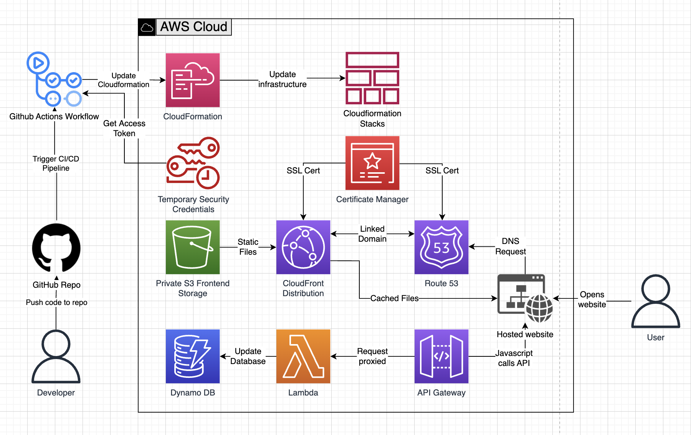

# joshgann-site

 

This website is running at https://www.joshgann.com

## Motivation
Recently, I completed the AWS Solution Architect - Associate certification, but wanted more hands on experience building in AWS.  I discovered the [Cloud Resume Challenge](https://cloudresumechallenge.dev/docs/the-challenge/aws/) while working on a few personal projects and tutorials.  I had also recently completed the [Complete AWS SAM Workshop](https://catalog.workshops.aws/complete-aws-sam/en-US), so using the Serverless Application Model along with the resume challenge felt like a good fit.  In the end, this project was incredibly useful as a learning tool, and quite interesting technically.

## Repository Contents
This project contains source code and supporting files for a serverless application that was built using the AWS Serverless Application Model (SAM). It includes the following files and folders:

- get_function - Code for a Lambda function to get data from the database.
- put_function - Code for a Lambda function to write data to the database.
- website - Source code of the website: static html, css, and javascript files.
- tests - Unit and integration tests for the application code. 
- .github/workflows - Github Actions CI/CD pipelines for the application and website.
- template.yaml - A template that defines the application's AWS resources.

## Architecture Diagram

The application uses several AWS resources, including Lambda functions and an API Gateway. These resources are defined in the `template.yaml` file in this project. 
The development flow of the architecture is:

- A developer pushes a change to the github repository.
- Either the application or website CI/CD pipeline is triggered.
- The pipelines follow this flow:
  - Obtain AWS credentials necessary to execute the pipeline.
  - Run unit tests against the local functions.
  - Deploy changes to the development stack in AWS via CloudFormation.
  - Run integration tests against the development environment.
  - Deploy changes to the production stack in AWS via CloudFormation.

The user flow of hte architecture is:
- The user opens the website at https://www.joshgann.com
- The domain is registered in Route 53, which is linked to a CloudFront distribution.
- The CloudFront distribution contains a cache of the static website files hosted in S3.
- After the HTTP handshake occurs, the static files are passed from CloudFront to the user's browser.
- Upon page load in the browser, javascript on the page executes a POST request to the API Gateway.
- API Gateway proxies this request to a Lambda function.
- The Lambda function updates a visitor count value in DynamoDB and returns the updated value back to API Gateway, which returns it back to the browser.
- The browser then updates this value on the page. 

## My development flow
### Static website
- I initially worked on the static website:
- I first converted my existing resume into HTML and CSS.
- Then I manually added this to an S3 bucket for hosting and registered my domain name in Route 53.

### Initial application
- I then started the application side by using the SAM CLI to spin up a hello world application.
- This contained an S3 bucket, and a Lambda function with an API Gateway.
- I deployed this directly from my computer to AWS via the SAM CLI just to get some basics running in AWS.

### Website into IAC
- Next, I worked on adding all of the parts needed to host the static website properly in the template.yaml file.
- S3 Bucket and Bucket Policy - for the static file hosting.
- CloudFrond Distribution - to cache the static files from S3 and better represent a production website.
- ACM Certificate - to add an SSL certification to the website.
- Route 53 - to configure the domain name and link up the CF Distribution and SSL Certificate.

### CI/CD pipeline
- After running the deployments from my local box and getting the basics setup, it was time to move this project to github, and establish a CI/CD pipeline.
- I set up this repo, and made the initial commit.
- Next, I used the SAM CLI to create the application pipeline, and created the necessary secrets in my github repo to enable the pipeline to access the AWS account.
- Once I was fairly confident that the pipeline would work, I used the SAM CLI to delete the existing stack in AWS.
- After a few cycles of bug fixes and adjustments, the pipeline was successfully deploying the infrastructure into a development and production stack in AWS, but I still needed to manually deploy the website contents to the S3 bucket.

### Split pipelines
- I decided to build a separate pipeline to deploy the static website contents, so code changes to the application or website did not affect each other.
- This wasn't too difficult in the end.
- I only needed to add the additional pipeline, then setup some path include and ignore patterns so the correct pipeline was triggered by the file changes.
- I also used the `reggionick/s3-deploy@v3` action to handle the deployment action and ensure the files are still private, and only accessible by the CloudFront distribution.
- This action is also used to invalidate the cached files in CloudFront, so that changes to the static files are immediately seen on the web. 

### Application development
- Now I wanted to get the application side working.
- I added the DynamoDB tables first and setup the Lambda function to pick up the correct table name depending on whether the dev or prod deployment was running.
- The Lambda function was next and it's job was just to increment a value in the database and pass the new value back to the caller.
- The SAM template made it fairly simple to attach the Lambda to an endpoint in the API Gateway, as well as add the necessary permissions for the Lambda to access the DynamoDB table.
- Once I got the Gateway API - Lambda - DynamoDB tested and working, I added the javascript to the website to POST to the API and update the page with the response.

## Taking it further
While this example is fairly complete there are some things that would be needed if this was a full production application:

- A proper pull request branching, review, and merge flow, tied into the pipeline.
- Fully separate AWS accounts for the development and production environments.
- A canary deployment on the production deployment step, to reduce the risk around bugs making it to production.
- Observability, monitoring, and alerting of failures in any service in the architecture. 

## Resources
See the [AWS SAM developer guide](https://docs.aws.amazon.com/serverless-application-model/latest/developerguide/what-is-sam.html) for an introduction to SAM specification, the SAM CLI, and serverless application concepts.

Next, you can use AWS Serverless Application Repository to deploy ready to use Apps that go beyond hello world samples and learn how authors developed their applications: [AWS Serverless Application Repository main page](https://aws.amazon.com/serverless/serverlessrepo/)
